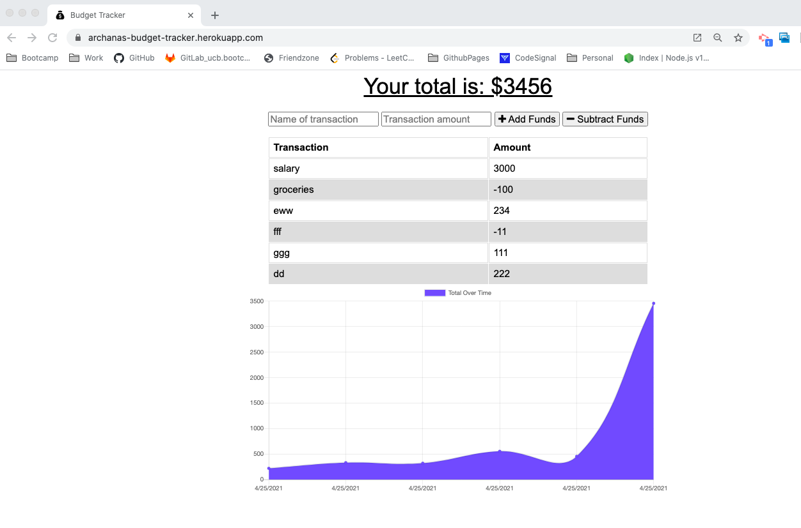
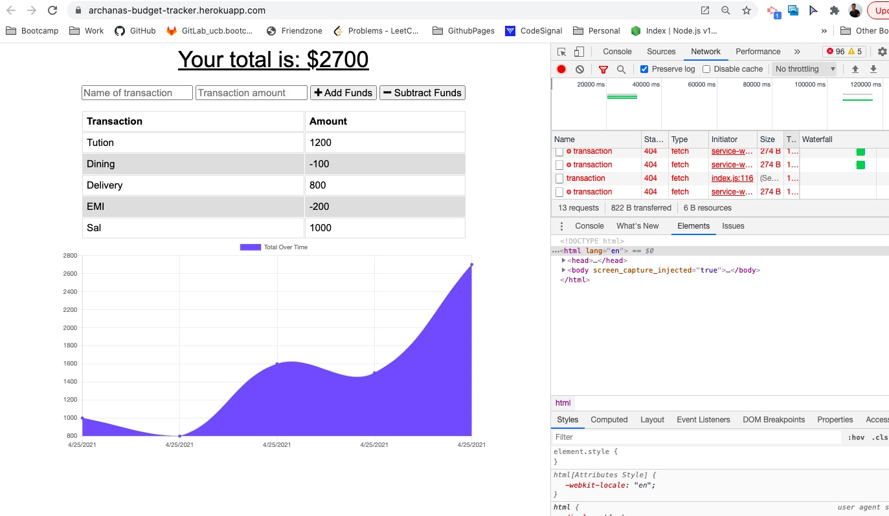
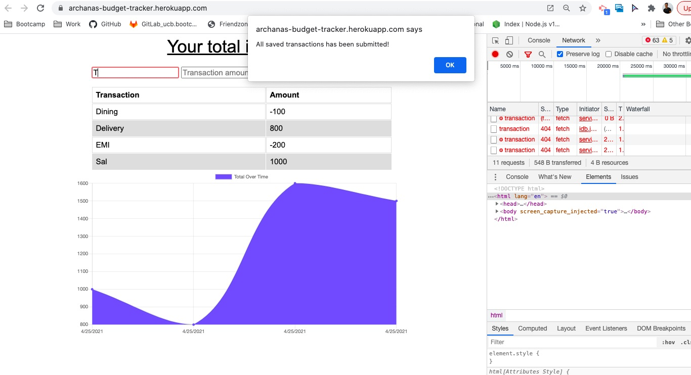

# Budget Tracker 

## Description 
This project is to update an existing budget tracker application to allow for offline access and functionality. The user will be able to add expenses and deposits to their budget with or without a connection. If the user enters transactions offline, the total should be updated when they're brought back online. The updated fully functional application is deployed in [Heroku](https://archanas-budget-tracker.herokuapp.com/) 

## Table of Contents
* [Installation](#installation)
* [Usage](#usage)
* [Technologies](#technologies)
* [License](#license)
* [Tests](#tests)
* [Questions](#questions)

## Installation 
 - Clone the repository from GitHub and install all the dependencies Refer package.json to learn about the packages. To run the server, run `npm start` in the CLI. 

## Usage 
This application will allow users to create new transactions whether it's a deposit or withdraw, with or without internet connection. 
Please view deployed application on [Heroku](https://archanas-budget-tracker.herokuapp.com/) 
* Budget Tracker App

* AppWhenOnline

* AppWhenOffline

For testing this application, user has to set browser offline after loading the application
User should still be able to perform add and subtract transacion operations. 
User can set back the network Online and then the actual api call will be perfomed.

## Technologies 
* [MongoDB Atlas](https://www.mongodb.com/cloud/atlas)
* [indexdb](https://developer.mozilla.org/en-US/docs/Web/API/IndexedDB_API)
* [heroku](https://www.heroku.com/)

## License 
This repository is licensed under the [MIT license](./LICENSE).

## Tests
There are no tests written for this application. 

## Questions
For any questions about the project/repository please contact me @ [archana.nagaraj@gmail.com](mailto:archana.nagaraj@gmail.com)  
GitHub @ [archana-nagaraj](https://github.com/archana-nagaraj) 